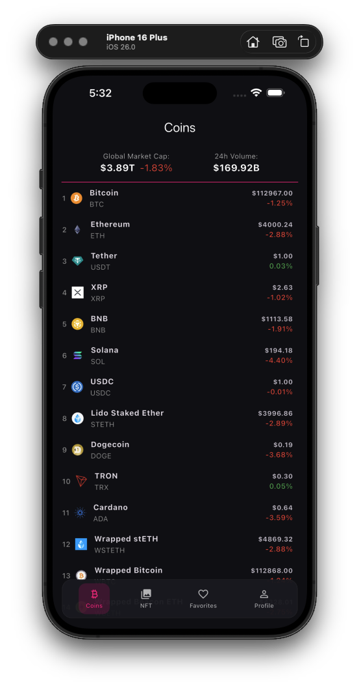
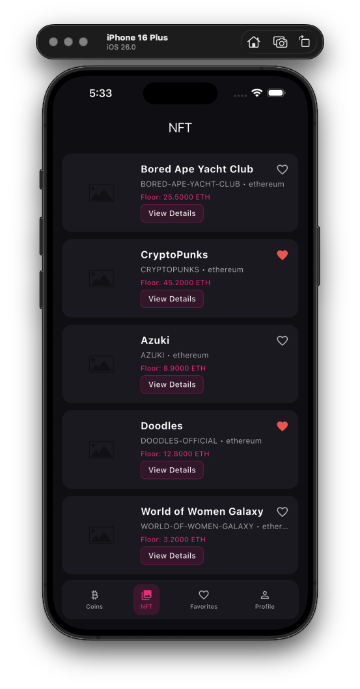

# 💰 Flutter Crypto App

A modern **cryptocurrency** and **NFT tracking** application built with Flutter, demonstrating **Clean Architecture** principles and best practices in modern mobile development.


---

## 📸 Screenshots

| Market                                    | NFT                                   |
|--------------|---------------------------------------|
|  |  |

---

## ✨ Features

- 💰 **Cryptocurrency Tracking** – Real-time crypto market data from CoinGecko
- 🎨 **NFT Marketplace** – Browse NFT collections via Reservoir API
- ⭐ **Favorites System** – Save and manage your favorite coins and NFTs
- 🔐 **Authentication** – Secure user authentication with Supabase
- 📊 **Detailed Analytics** – View comprehensive coin and NFT details
- 🌙 **Theme Support** – Light and dark mode
- 📱 **Responsive Design** – Optimized for all screen sizes

---

## 🏗️ Architecture

This project follows **Clean Architecture** principles with clear separation of concerns across three layers:

```
lib/
├── core/                          # Shared utilities and base classes
│   ├── di/                        # Dependency injection (GetIt)
│   ├── routing/                   # Navigation configuration (GoRouter)
│   ├── theme/                     # App theming
│   ├── widgets/                   # Shared widgets
│   ├── logger/                    # Logging utilities
│   ├── utils/                     # Helper functions & retry strategies
│   └── exceptions/                # Custom exceptions
├── features/                      # Feature modules
│   ├── coin/                      # Cryptocurrency feature
│   │   ├── data/                  # Data layer
│   │   │   ├── coin_repository_impl.dart  # Repository implementation
│   │   │   ├── coin_mapper.dart   # Data mapping
│   │   │   └── coin_service.dart  # API service (legacy)
│   │   ├── domain/                # Business logic layer
│   │   │   ├── coin.dart          # Domain entity
│   │   │   └── coin_repository.dart # Repository interface
│   │   └── presentation/          # UI layer
│   │       ├── pages/             # Screens
│   │       ├── bloc/              # BLoC for state management
│   │       └── widgets/           # Feature-specific widgets
│   ├── auth/                      # Authentication feature
│   │   ├── data/                  # Auth service & data layer
│   │   ├── domain/                # User model
│   │   └── presentation/          # Login/Signup pages & Cubit
│   ├── profile/                   # User profile feature
│   └── globalmarket/              # Global market data feature
```

---

### 🧩 Architecture Layers

**Data Layer**
- API services for external data sources
- Data models with JSON serialization
- Repository implementations
- Local storage management

**Domain Layer**
- Business entities
- Repository interfaces
- Use cases (business logic)

**Presentation Layer**
- UI screens and widgets
- Riverpod providers for state management
- View models

---

## 🛠️ Tech Stack

**Core**
- Flutter SDK: `3.9+`
- Dart: `3.9.2+`
- Architecture: Clean Architecture
- State Management: BLoC / Cubit (flutter_bloc)
- DI Container: GetIt
- Navigation: GoRouter

**Key Dependencies**

| Package | Purpose |
|----------|----------|
| `flutter_bloc` | State management (BLoC/Cubit pattern) |
| `get_it` | Service locator & dependency injection |
| `go_router` | Declarative routing & navigation |
| `fpdart` | Functional programming (Either for error handling) |
| `supabase_flutter` | Backend-as-a-Service (Auth + Database) |
| `http` | HTTP client for API requests |
| `equatable` | Value equality for BLoC states |
| `shared_preferences` | Local data persistence |

---

## 📦 API Integrations

### 🪙 CoinGecko API
Free cryptocurrency data API providing:
- Market data for 10,000+ cryptocurrencies
- Price charts and historical data
- Market statistics and trends
- No API key required

**Base URL:** `https://api.coingecko.com/api/v3/`

---

### 🎨 Reservoir API
NFT marketplace aggregator providing:
- NFT collection data
- Floor prices and sales
- Collection metadata

**Base URL:** `https://api.reservoir.tools/`  
(May require API key for production)

---

### 🧰 Supabase
Used for:
- User authentication (email/password)
- Session management
- Database operations

---

## 🚀 Getting Started

### 🧱 Prerequisites
- Flutter SDK 3.9 or higher
- Dart 3.9.2 or higher
- iOS Simulator / Android Emulator or physical device
- Supabase account (for authentication features)

### 🔧 Installation

#### 1️⃣ Clone the repository
```bash
git clone https://github.com/teasec4/flutter-crypto-app.git
cd flutter-crypto-app
```

#### 2️⃣ Install dependencies
```bash
flutter pub get
```

#### 3️⃣ Configure Supabase
Create file `lib/core/secrets/app_secrets.dart`:
```dart
class AppSecrets {
  static const String supabaseUrl = 'YOUR_SUPABASE_URL';
  static const String supabaseAnonKey = 'YOUR_SUPABASE_ANON_KEY';
}
```

Get your credentials from [Supabase](https://supabase.com):
- Create a new project
- Go to **Settings → API**
- Copy the **Project URL** and **anon/public key**

#### 4️⃣ Run the app
```bash
flutter run
```

#### 5️⃣ Build for production

📱 **Android**
```bash
flutter build apk --release
# or
flutter build appbundle --release
```

🍎 **iOS**
```bash
flutter build ios --release
```

---

## 🎯 Project Structure Highlights

### 🧩 Dependency Injection with GetIt
```dart
void setupServiceLocator() {
  // Register repositories
  getIt.registerSingleton<CoinRepository>(CoinRepositoryImpl());
  
  // Register BLoCs/Cubits
  getIt.registerSingleton<CoinBloc>(
    CoinBloc(getIt<CoinRepository>(), getIt<RetryStrategy>()),
  );
}
```

---

### 🌀 State Management with BLoC
```dart
class CoinBloc extends Bloc<CoinEvent, CoinState> {
  CoinBloc(this._repo, this._retryStrategy) : super(const CoinInitial()) {
    on<CoinInitialLoad>(_onInitialLoad);
    on<CoinLoadMore>(_onLoadMore);
  }
  
  Future<void> _onInitialLoad(CoinInitialLoad event, Emitter<CoinState> emit) async {
    emit(const CoinLoading());
    try {
      final coins = await _repo.getCoins(page: 1, perPage: 30);
      emit(CoinLoaded(coins: coins));
    } catch (e) {
      emit(CoinError(e.toString()));
    }
  }
}
```

---

### 🧠 Authentication with Cubit
```dart
class AuthCubit extends Cubit<AuthState> {
  AuthCubit(this._service) : super(const AuthInitial());
  
  Future<void> signIn({required String email, required String password}) async {
    emit(const AuthLoading());
    final result = await _service.signIn(email: email, password: password);
    result.match(
      (failure) => emit(AuthError(failure.message)),
      (user) => emit(AuthAuthenticated(user)),
    );
  }
}
```

---

### 🗺️ Type-Safe Navigation with Go Router
```dart
GoRouter(
  redirect: (context, state) {
    final authState = getIt<AuthCubit>().state;
    final isAuthenticated = authState is AuthAuthenticated;
    // Smart redirects based on auth state
  },
  routes: [
    GoRoute(path: '/coins', builder: (context, state) => const CoinPage()),
    GoRoute(
      path: '/coins/details/:id',
      builder: (context, state) {
        final coin = state.extra as Coin;
        return CoinDetailPage(coin: coin);
      },
    ),
  ],
);
```

---

## 📚 What You Can Learn

✅ Clean Architecture – Proper separation of concerns  
✅ BLoC/Cubit Pattern – Scalable state management  
✅ GetIt – Service locator for dependency injection  
✅ Go Router – Type-safe declarative navigation  
✅ Repository Pattern – Clean data abstraction layer  
✅ Functional Programming – Either type for error handling  
✅ Supabase Integration – Firebase alternative for Auth & Database  
✅ API Integration – REST API consumption with proper error handling  
✅ Retry Strategy – Exponential backoff for resilient requests  
✅ Authentication Guards – Route protection based on auth state

---

## 🧪 Testing

```bash
# Run all tests
flutter test

# Run with coverage
flutter test --coverage

# Run integration tests
flutter test integration_test
```

---

## 📱 Features Breakdown

### 🪙 Coin Feature
- Browse cryptocurrency market
- Search and filter coins
- View detailed coin information
- Price charts and statistics
- Add to favorites

### 🎨 NFT Feature
- Explore NFT collections
- View collection details
- Floor prices and volume
- Metadata display

### ⭐ Favorites Feature
- Save favorite coins & NFTs
- Local persistence
- Quick access to saved items

### 🔐 Auth Feature
- Email/password authentication
- Session management
- Protected routes
- User profile

---

## ⚙️ Configuration

Example environment config:
```dart
class EnvConfig {
  static const bool isProduction = bool.fromEnvironment('dart.vm.product');
  static const String apiBaseUrl = String.fromEnvironment(
    'API_BASE_URL',
    defaultValue: 'https://api.coingecko.com/api/v3/',
  );
}
```

Run with:
```bash
flutter run --dart-define=API_BASE_URL=https://your-api.com
```

---

## 🤝 Contributing

1. Fork the project
2. Create a feature branch:
   ```bash
   git checkout -b feature/AmazingFeature
   ```
3. Commit your changes:
   ```bash
   git commit -m 'Add some AmazingFeature'
   ```
4. Push to the branch:
   ```bash
   git push origin feature/AmazingFeature
   ```
5. Open a Pull Request

---

## 📄 License

This project was created for **educational purposes**.

---

## 👤 Author

**teasec4**
- GitHub: [@teasec4](https://github.com/teasec4)

---

## 🙏 Acknowledgments

- [CoinGecko](https://www.coingecko.com/) – for free crypto API
- [Reservoir](https://reservoir.tools/) – for NFT data
- [Supabase](https://supabase.com/) – for backend services
- Flutter & Dart communities for excellent tools

---

## 📖 Resources

- [Flutter Documentation](https://docs.flutter.dev/)
- [Riverpod Documentation](https://riverpod.dev/)
- [Clean Architecture Guide](https://resocoder.com/category/clean-architecture/)
- [Go Router Documentation](https://pub.dev/packages/go_router)

---

⭐️ **If this project helped you learn Flutter and Clean Architecture, give it a star!**
